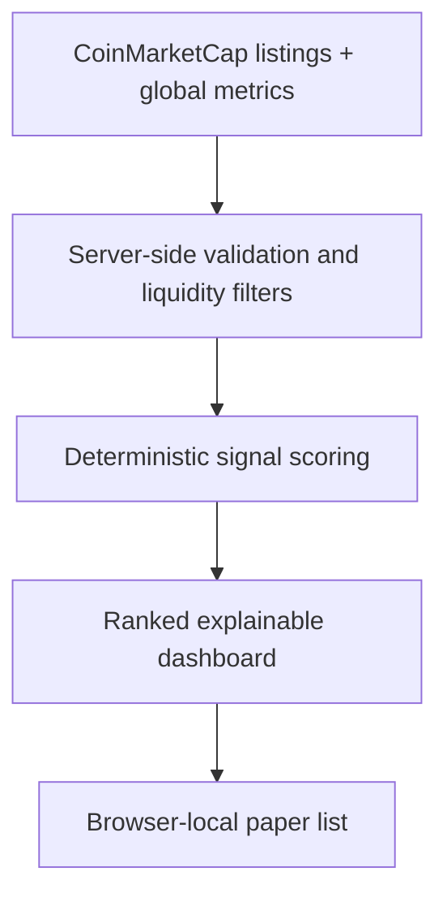

# Catalyst Edge

Catalyst Edge is an explainable market-signal engine built for the 2026 CoinMarketCap API Hackathon. It converts live CMC data into ranked, short-duration research setups with transparent levels and factor-by-factor scoring.

[Open the live demo](https://catalyst-edge.saptael.chatgpt.site) · [Watch the 24-second walkthrough](https://catalyst-edge.saptael.chatgpt.site/Catalyst_Edge_Demo.mp4) · [Read the submission package](SUBMISSION.md)

## What it does

- Fetches the top 100 cryptoassets and global market metrics from CoinMarketCap.
- Excludes stablecoins and assets with insufficient market cap, volume, or turnover.
- Scores momentum, liquidity, trend alignment, and market-regime agreement.
- Ranks the eight strongest long and short research signals.
- Calculates an entry band, target, invalidation level, and modeled loss on a fixed $100 paper allocation.
- Saves selected setups to a browser-local paper list; it never sends an order.
- Reports the CMC endpoints, UTC refresh time, and honest live/degraded status in the UI.

## How the score works

The deterministic model combines weighted 1-hour, 24-hour, and 7-day momentum; volume-to-market-cap turnover; directional agreement across those periods; and alignment with the global market-cap regime. Every component is visible in the selected setup's detail panel.

This prototype demonstrates explainable market screening. It is not an execution venue, financial advice, a backtest, or a promise of returns.

## CoinMarketCap API use

The public prototype uses CMC's keyless public API so judges can run it without secrets:

- `GET /public-api/v1/cryptocurrency/listings/latest`
- `GET /public-api/v1/global-metrics/quotes/latest`

Requests run server-side and use a 60-second shared cache. A keyed Startup-tier integration can replace the base URL without exposing the key to the browser.

## Architecture



Built with Next.js 16, React 19, TypeScript, Vinext/Vite, and Cloudflare Workers.

## Judge walkthrough

1. Confirm **CMC LIVE**, the UTC refresh time, and the verified endpoint count.
2. Compare the ranked setups and switch between **ALL**, **LONG**, and **SHORT**.
3. Select an asset to inspect its entry, target, invalidation, and modeled loss.
4. Review the momentum, liquidity, trend-alignment, and market-regime factors.
5. Add the setup to the browser-local paper list.
6. Verify the two CMC requests in **API evidence**.

## Local development

Requires Node.js 22.13 or newer.

```bash
npm ci
npm run dev
```

Run a production build with `npm run build`.

## Hackathon track

Markets and Trading Tools

## License

[MIT](LICENSE)
